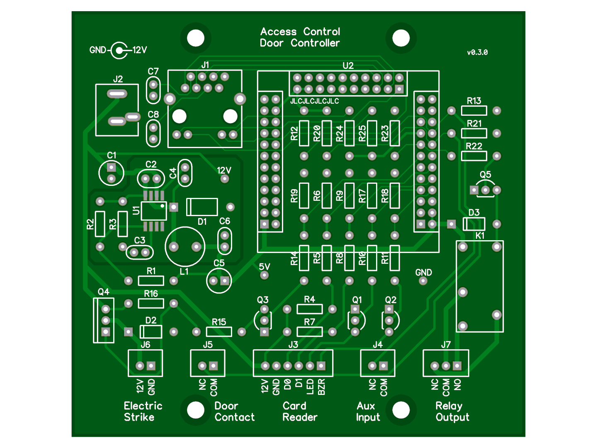

# access-control

DIY door access control system with NanoPi

# Hardware

[DipTrace][1] files, `gerber` works with [JLCPCB][2]

You need to plug a [NanoPi Neo Core][3] on to it

  [1]: https://diptrace.com/
  [2]: https://jlcpcb.com/
  [3]: https://www.friendlyarm.com/index.php?route=product/product&path=69&product_id=212

These are the gpio pins that are used:

BCM | wPi | physical | function
--- | --- | --- | ---
  0 |   0 |  11 | lock
  6 |   1 |  12 | door contact
  2 |   2 |  13 | reader d0
  3 |   3 |  15 | reader d1
200 |   4 |  16 | reader led
201 |   5 |  18 | reader buzzer
  1 |   6 |  22 | doorbell
203 |   7 |   7 | relay out

# Software

## OS setup

Download [Armbian][1] Bionic image and [7-Zip][2] to extract it.

Use [Etcher][4] to flash the image onto your [SD card][3].

Boot the hardware from the SD card and use [Putty][5] to access it.

  [1]: https://www.armbian.com/nanopi-neo/
  [2]: https://www.7-zip.org/
  [3]: https://shop.sandisk.com/store/sdiskus/en_US/pd/productID.5163153100/SanDisk-Ultra-microSDXC-UHSI-Card-32GB-A1C10U1
  [4]: https://www.balena.io/etcher/
  [5]: https://www.chiark.greenend.org.uk/~sgtatham/putty/latest.html

## Initial config

* login as `root` using `1234`
* change password
* new user wizard
  * password
  * skip all the questions
* `apt update`
* `DEBIAN_FRONTEND=noninteractive apt upgrade -y`
* `armbian-config`
    * System > Install > Install/Update the bootloader on SD/eMMC > Yes
    * Ok > Back
    * Personal > Hostname > type a new hostname
    * Personal > Timezone > set that too
    * Ok > Ok > Back > Exit
* `shutdown -r now` to reboot

## Usage

Use your new username and password

## Local Development

`vagrant up` for dev at http://localhost:8080
