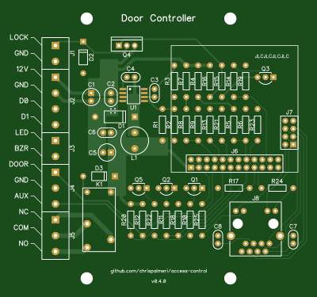

# doorctl

DIY door access control system with NanoPi

Software part is very much unfinished

<!--

order spare inventory parts

board changes:
  put 12V at the top, move lock?
  you meant to widen lock trace
  you could make the JLCJLC text bigger
  and the github text
  any way to get the resistor designators readable? smaller?
  upsidedown ethernet kinda bugs me

python
  update docs
  totp

-->

# Hardware

[DipTrace][1] files, `gerber.zip` works with [JLCPCB][2]

Removed SVG's from repo but you can drop `gerber.zip` into [tracespace][3] to generate.

You need to plug a [NanoPi Neo Core][4] on to it

  [1]: https://diptrace.com/
  [2]: https://jlcpcb.com/
  [3]: https://tracespace.io/view/
  [4]: https://www.friendlyelec.com/index.php?route=product/product&path=69&product_id=212

These are the gpio pins that are used:

Name | Physical | libgpiod | Type | Description
---  | ---      | ---      | ---  | ---
PA1  | 22       | 1        | OUT  | lock
PG8  | 16       | 200      | OUT  | relay out
PG9  | 18       | 201      | OUT  | reader led
PA6  | 12       | 6        | OUT  | reader buzzer
PA3  | 15       | 3        | IN   | reader d0
PG11 | 7        | 203      | IN   | reader d1
PG6  | 8        | 198      | IN   | door contact
PG7  | 10       | 199      | IN   | doorbell

# Software

## Preparation

Download [Armbian][5] Bullseye CLI image (get the latest archive version),
use [Etcher][6] to flash the image onto your [SD card][7].

Install the SD card and power up the board.

  [5]: https://www.armbian.com/nanopi-neo/
  [6]: https://etcher.balena.io/
  [7]: https://www.westerndigital.com/products/memory-cards/sandisk-ultra-uhs-i-microsd#SDSQUA4-032G-GN6MA

## First boot

Use [Windows Terminal][8] to `ssh root@nanopineo` and login with password `1234`.

* enter new root password twice
* pick `1` for "bash" terminal
* enter new username (e.g. `doorctl`)
* password twice
* display name
* `Enter` to accept language based on detected timezone
* pick `1` for "en_US.UTF-8"
* Run `armbian-config`
    * Personal > Hostname > type a new hostname (e.g. `doorctl-dev`) > Ok > Back
    * System > Install > Install/Update the bootloader on SD/eMMC > Yes
    * System > Install > Boot from eMMC - system on eMMC > Yes > ext4 > Power Off

Unplug power, Remove SD card.

  [8]: https://apps.microsoft.com/store/detail/windows-terminal/9N0DX20HK701

<!--
I think you could then reuse the SD card on additional boards
and only need to do the hostname, bootloader, eMMC steps
-->

## Installation

Connect all your door hardware, reconnect power.

Reconnect over SSH using new username and new hostname.

`sudo apt update`

`sudo apt upgrade`

### Option 1: On device

Over SSH connection:

`git clone https://github.com/chrispalmeri/access-control.git`

`cd access-control`

`sudo ./install.sh`

`sudo shutdown -r now` to reboot

### Option 2: Remote development

On Windows host:

`git clone git@github.com:chrispalmeri/access-control.git`

Setup [VS Code][9] and open folder. Enable SFTP extension.

Ctrl-Shift-P > SFTP: Upload Project

Click SFTP icon in sidebar, then click icon on connection to open terminal

`curl -s https://raw.githubusercontent.com/chrispalmeri/access-control/master/install.sh | sudo bash`

`sudo shutdown -r now` to reboot

<!--
reboot maybe should be part of the script?
printing IP address should also be part of the script
-->

Run `sudo systemctl restart doorctl` whenever you make changes

  [9]: https://code.visualstudio.com/download

## Usage

Navigate to IP address in browser.

<!--
If events shows wrong contact status and wiegand readding errors

remote in `nano access-control/code/config.py`
change pin numbers to correct ones for your board
Ctrl+S, Ctrl+X
`sudo systemctl restart doorctl`

I think it has the 60 sec websocket hang when stopping again
just wait a minute and then it is good
-->

Swipe a card and check the events for the number. Then use Postman to add a user with `POST` to `/api/users`.

Should be good to go. Check that the hardware is all working correctly.

## Troubleshooting

Restart process with `sudo systemctl restart doorctl`

Check for errors with `sudo journalctl -u doorctl --since "5 minutes ago"`

## Locally

`vagrant up` then go to http://localhost:8080/

Maybe `vagrant reload` but I don't think it is required

<!--
if you `vagrnat halt` and `vagrant up` you might have to `vagrant ssh` and `sudo systemctl restart doorctl`
seems like the wait for vagrant shared folder to mount might not actually be waiting
-->

If there are issues `vagrant ssh` then use troubleshooting commands above.

There will be no GPIO locally, so none of that stuff will do anything.

## Update

`cd access-control`, `git fetch` then `git status`

If there are updates `git pull`.

Maybe should `sudo ./install.sh` again? Might stop service first, delete database if you want to see that created, ignore reboot message after install.

`sudo systemctl restart doorctl`
